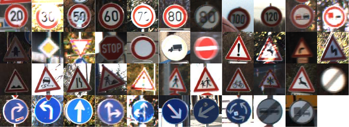
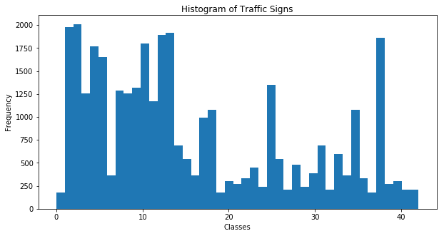
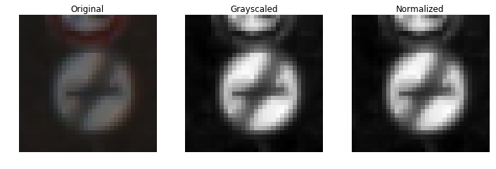
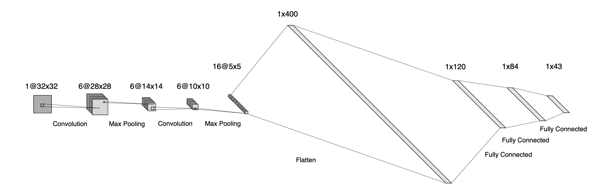
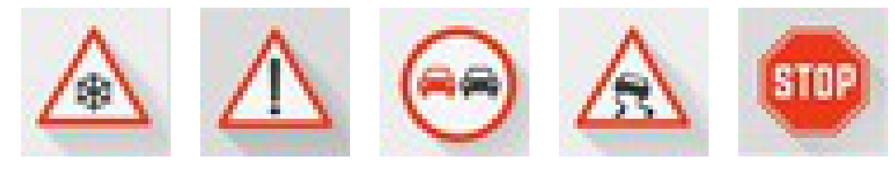
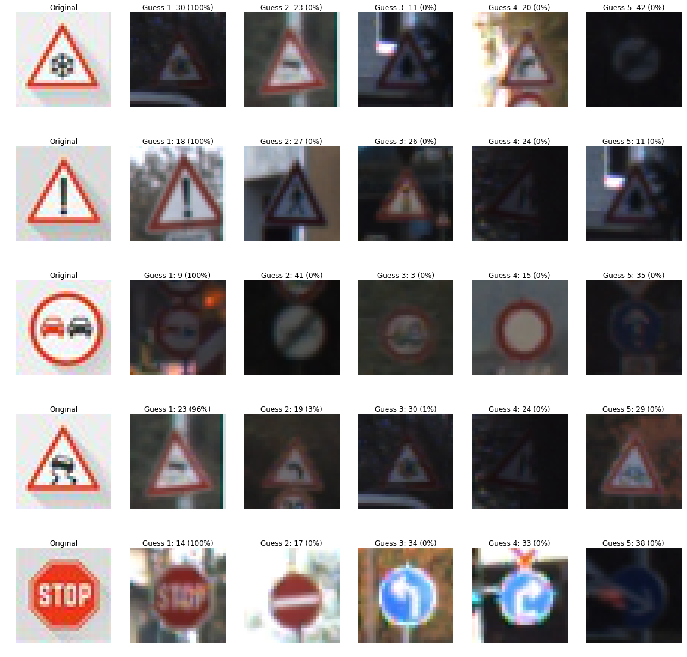
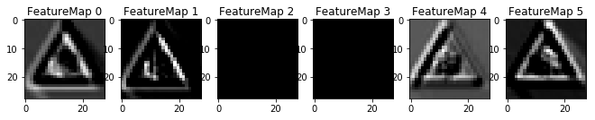
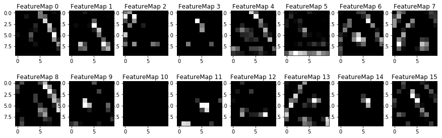

# **Traffic Sign Recognition** 

## **Objective**
This project describes using of deep neural networks and convolutional neural networks to classify traffic sign. The training dataset is obtained from the German Traffic Sign Dataset.

## **Neural Network Overview**

**Dataset**

  

* The size of training set is 34799.
* The size of the validation set is 4410.
* The size of test set is 12630.
* The shape of a traffic sign image is 32 x 32 x 3 in RGB format.
* The number of unique classes/labels in the data set is 43.

Here is an histogram showing the distribution of the data set.

  

**Pre-processing**

There are two pre-processing being done on the dataset:

1. Conversion of RGB image to grayscale. This is because images are taken under different lighting conditions and RGB color may not be consistent. 

2. Normalization of grayscale image. This is done to improve contrast of the images, and to make convergence of neural network faster.

Here is an example showing the difference between the original image and processed image.

  

**Network Layers**

The neural network is consisted of the following layers:

| Layer                 |Description                                                    | 
|:---------------------:|:-------------------------------------------------------------:| 
| Input                 | 32x32x1 RGB image                                             | 
| Convolution 5x5       | 5x5 kernel, 1x1 stride, valid padding, outputs 28x28x6        |
| RELU                  |                                                               |
| Max pooling           | 2x2 stride, outputs 14x14x6                                   |
| Convolution 5x5       | 5x5 kernel, 1x1 stride, valid padding, outputs 10x10x16       |
| RELU                  |                                                               |
| Max pooling           | 2x2 stride, outputs 5x5x16                                    |
| Flatten               | outputs 400                                                   |
| Fully connected       | outputs 120                                                   |
| RELU                  |                                                               |
| Dropout               | 0.5 keep probability                                          |
| Fully connected       | outputs 84                                                    |
| RELU                  |                                                               |
| Dropout               | 0.5 keep probability                                          |
| Fully connected       | outputs 43                                                    |
| Output                | 43 score                                                      |

  

**Hyper-parameters**

The following hyper-parameters are used to train the model:

* Epochs: 15
* Batch size: 64
* Learning rate: 0.001
* Keep probability: 0.5

The model is using Adam optimizer to minimize loss function.

**Results**

The network results are:

* Training set accuracy: 99.1%
* Validation set accuracy: 94.5%
* Test set accuracy: 92.0%

The network model is based on LeNet-5 Convolutional Neural Network. LeNet was originally used to recognize patterns with extreme variability such as handwritten character. Therefore, the same architecture is used to classify traffic signs under various lighting conditions. However, during initial training, the accuracy of validation set is lower than the accuracy of training set by more than 5%, indicating overfitting. Thus, dropout layers are added after the activation layers of the fully connected layers, reducing the difference to below 5%. Furthermore, the training set accuracy is below 95% with epochs of 5 and batch size of 128, indicating underfitting. To overcome this issue, number of epochs is increased while batch size is reduced to allow more iterations for the network to learn, increasing training set accuracy to above 99%. Finally, increasing or decreasing the learning rate reduces the performance of the network, so learning rate is kept constant.

## **Test Model on New Images**

**Images**

Here are five German traffic signs found on the web:

  

Since these images are clear, the model is expected to perform well on them.

**Results**

The network results are:

* Test set accuracy: 92.0%
* New images accuracy: 100.0%

  

The model is able to correctly guess 5 out of the 5 traffic signs, which gives an accuracy of 100%. This compares favorably to the accuracy on the test set of 92.0%. In fact, the model is fairly certain about its predictions, as it gives 1st guess for each of the 5 images a probability of being correct of close to 100.0%!

## **Visualization of Feature Maps**

Here is the visualization of feature maps of convolution layer 1 and 2 respectively, given the same sample image.

  

  

  

